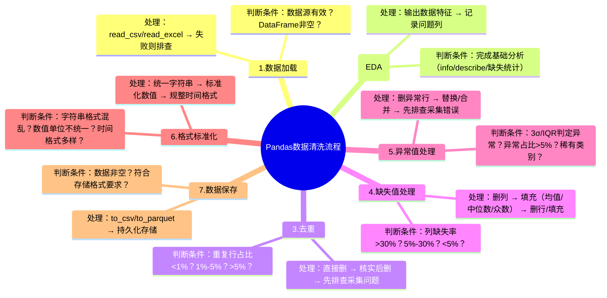

### 1. 需求确认
你需要梳理一套标准化的pandas数据清洗流程（数据加载→探索性分析→去重→缺失值→异常值→格式标准化→保存），并为每个步骤标注核心判断条件，同时编写对应的流程思维导图，以便系统化落地数据清洗工作。

### 2. 标准化pandas数据清洗流程（含判断条件+处理方案）
以下是可落地的标准化流程，每个步骤明确**目标**、**核心判断条件**和**处理方式**，适配新手快速上手：

| 步骤               | 核心目标                     | 关键判断条件                                                                 | 主流处理方式（pandas实现）                                                                 |
|--------------------|------------------------------|------------------------------------------------------------------------------|-------------------------------------------------------------------------------------------|
| 1. 数据加载        | 成功读取数据源为DataFrame    | ① 文件/数据源是否存在；② 加载后DataFrame是否为空                              | `pd.read_csv()`/`pd.read_excel()`/`pd.read_sql()`，加载失败则排查路径/连接，空数据终止流程 |
| 2. 探索性分析（EDA）| 摸清数据特征，指导后续清洗    | 无强制判断，需完成基础分析：维度、数据类型、缺失分布、描述性统计、唯一值分布    | `df.info()`/`df.describe()`/`df.isnull().sum()`/`df.value_counts()`，记录核心问题列       |
| 3. 去重            | 删除重复行，保证数据唯一性    | ① 重复行占比<1%：直接删；② 1%-5%：核实原因后删；③ >5%：先排查采集问题        | `df.drop_duplicates(subset=['关键列'], keep='first')`                                     |
| 4. 缺失值处理      | 合理填补/删除缺失，避免偏差   | ① 列缺失率>30%：删除列（核心列除外）；② 5%-30%：填充；③ <5%：删行或填充       | 填充：`df.fillna({'数值列': df['列'].median(), '类别列': df['列'].mode()[0]})`；删除：`df.dropna()` |
| 5. 异常值处理      | 识别并修正偏离正常范围的值    | ① 数值型：3σ/IQR判定异常；② 类别型：稀有值（占比<1%）；③ 异常占比>5%：先排查  | 删异常行：`df[~异常条件]`；替换：`df.clip(lower=下限, upper=上限)`；类别合并：`df.replace(稀有值, '其他')` |
| 6. 格式标准化      | 统一数据格式，保证一致性      | ① 字符串：空格/大小写/特殊字符；② 数值：文本格式/单位不统一；③ 时间：格式混乱 | 字符串：`df['列'].str.strip().str.upper()`；时间：`pd.to_datetime(df['列'])`；数值：`df['列'].str.extract('(\d+)').astype(float)` |
| 7. 数据保存        | 持久化清洗后的数据           | ① 清洗后数据是否为空；② 业务要求的存储格式（CSV/Parquet/SQL等）               | `df.to_csv('清洗后数据.csv', index=False, encoding='utf-8')`/`df.to_parquet()`              |

### 3. 流程思维导图（Mermaid语法）
可直接复制到支持Mermaid的工具（如Markdown编辑器、Mermaid Live Editor）生成可视化思维导图，标注了每个步骤的核心判断条件：



### 4. 实操示例代码（完整流程）
以下是整合上述流程的通用清洗代码模板，可直接复用，包含关键判断逻辑：

```python
import pandas as pd
import numpy as np

def standard_data_cleaning(file_path, save_path):
    """
    标准化pandas数据清洗函数
    :param file_path: 原始数据路径（CSV/Excel）
    :param save_path: 清洗后数据保存路径
    :return: 清洗后的DataFrame
    """
    # ===================== 1. 数据加载 =====================
    try:
        if file_path.endswith('.csv'):
            df = pd.read_csv(file_path, encoding='utf-8')
        elif file_path.endswith('.xlsx'):
            df = pd.read_excel(file_path)
        else:
            raise ValueError("仅支持CSV/Excel格式")
        if df.empty:
            raise ValueError("加载的数据集为空，请检查数据源")
        print(f"数据加载成功，原始数据维度：{df.shape}")
    except Exception as e:
        print(f"数据加载失败：{e}")
        return None

    # ===================== 2. 探索性分析 =====================
    print("\n=== 探索性分析结果 ===")
    print("数据基本信息：")
    print(df.info())
    print("\n描述性统计：")
    print(df.describe())
    print("\n缺失值分布（列）：")
    missing_rate = df.isnull().sum() / len(df) * 100
    print(missing_rate[missing_rate > 0])

    # ===================== 3. 去重 =====================
    duplicate_count = df.duplicated().sum()
    duplicate_rate = duplicate_count / len(df) * 100
    print(f"\n重复行数量：{duplicate_count}，占比：{duplicate_rate:.2f}%")
    if duplicate_rate > 0:
        if duplicate_rate <= 5:  # 1%-5%直接删，<1%也删
            df = df.drop_duplicates(keep='first')
            print("已删除重复行")
        else:
            print("重复行占比过高，请先排查数据采集流程")
            return None

    # ===================== 4. 缺失值处理 =====================
    print("\n=== 缺失值处理 ===")
    for col in df.columns:
        col_missing_rate = missing_rate[col]
        if col_missing_rate > 30:
            print(f"列{col}缺失率{col_missing_rate:.2f}%，已删除")
            df = df.drop(columns=[col])
        elif 5 <= col_missing_rate <= 30:
            if df[col].dtype in ['int64', 'float64']:
                fill_value = df[col].median()  # 数值型用中位数
            else:
                fill_value = df[col].mode()[0]  # 类别型用众数
            df[col] = df[col].fillna(fill_value)
            print(f"列{col}缺失率{col_missing_rate:.2f}%，已填充（值：{fill_value}）")
        elif 0 < col_missing_rate < 5:
            df = df.dropna(subset=[col])
            print(f"列{col}缺失率{col_missing_rate:.2f}%，已删除缺失行")

    # ===================== 5. 异常值处理（数值型列） =====================
    print("\n=== 异常值处理（数值型列） ===")
    numeric_cols = df.select_dtypes(include=['int64', 'float64']).columns
    for col in numeric_cols:
        # IQR法判定异常值
        Q1 = df[col].quantile(0.25)
        Q3 = df[col].quantile(0.75)
        IQR = Q3 - Q1
        lower_bound = Q1 - 1.5 * IQR
        upper_bound = Q3 + 1.5 * IQR
        # 异常值判断
        outliers = df[(df[col] < lower_bound) | (df[col] > upper_bound)]
        outlier_rate = len(outliers) / len(df) * 100
        print(f"列{col}异常值占比：{outlier_rate:.2f}%")
        if outlier_rate > 0:
            if outlier_rate <= 1:
                df = df[(df[col] >= lower_bound) & (df[col] <= upper_bound)]
                print(f"已删除列{col}异常行")
            elif 1 < outlier_rate <= 5:
                # 用上下限替换异常值
                df[col] = df[col].clip(lower=lower_bound, upper=upper_bound)
                print(f"已替换列{col}异常值（上下限：{lower_bound:.2f}/{upper_bound:.2f}）")
            else:
                print(f"列{col}异常值占比过高，请排查数据采集问题")

    # ===================== 6. 格式标准化 =====================
    print("\n=== 格式标准化 ===")
    # 字符串列：去空格、统一大写
    str_cols = df.select_dtypes(include=['object']).columns
    for col in str_cols:
        df[col] = df[col].astype(str).str.strip().str.upper()
        print(f"列{col}已完成字符串标准化")
    # 时间列：统一格式
    time_cols = [col for col in df.columns if 'time' in col.lower() or 'date' in col.lower()]
    for col in time_cols:
        df[col] = pd.to_datetime(df[col], errors='coerce')
        print(f"列{col}已标准化为时间格式")

    # ===================== 7. 数据保存 =====================
    try:
        if save_path.endswith('.csv'):
            df.to_csv(save_path, index=False, encoding='utf-8')
        elif save_path.endswith('.xlsx'):
            df.to_excel(save_path, index=False)
        elif save_path.endswith('.parquet'):
            df.to_parquet(save_path, index=False)
        print(f"\n数据清洗完成，清洗后维度：{df.shape}，已保存至：{save_path}")
        return df
    except Exception as e:
        print(f"数据保存失败：{e}")
        return None

# 调用示例
if __name__ == "__main__":
    cleaned_df = standard_data_cleaning("原始数据.csv", "清洗后数据.csv")
```

### 总结
1. 标准化清洗流程核心逻辑：**先探索再处理，按“影响程度”判断处理方式**（如缺失率>30%删列、异常值占比>5%先排查而非直接删）；
2. 每个步骤的判断条件是核心：需结合“占比阈值”+“业务逻辑”（核心列不轻易删除），避免机械清洗；
3. 代码模板可直接复用，需根据实际业务调整阈值（如缺失率、异常值占比）和填充/替换规则。